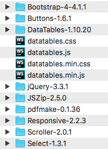

# Flask and mongo-datatables
A sample website that shows how to use mongo-datatables with Flask.

----

## Get started

Clone the repo and install the requirements to get started.

      git clone git@github.com:pauljolsen/flask-and-mongo-datatables.git flask-demo
      cd flask-demo
      virtualenv -p python3 ~/.venvs/flask-demo
      source ~/.venvs/flask-demo/bin/activate
      pip install -r requirements.txt 
      flask run

Of course you'll need a MongoDB named 'myDatabase' running on localhost, and the 'contracts' collection with a few documents
using the keys seen in the table_view.html template: ExpiryDate, ContractId, Vendor, and Note.

## DataTables static files

These are the packages I linked to from DataTables. Note that I have excluded the Editor from
this demo because you have to pay to use Editor.  If you go that route, you'll have to download
DataTables static files and plug them into your Flask app.

## mongo-datatables

Find mongo-datatables at <https://github.com/pauljolsen/mongo-datatables>.

